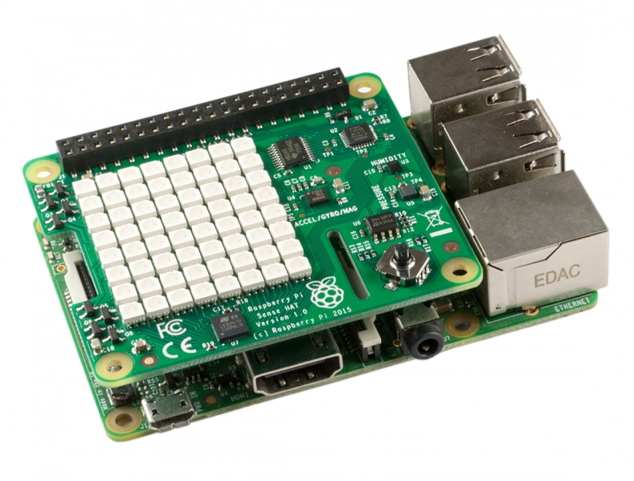
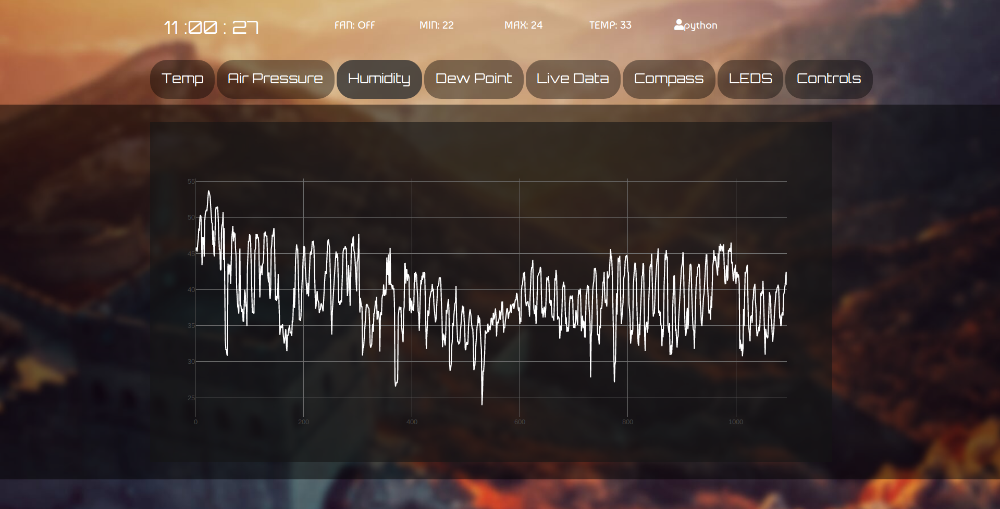
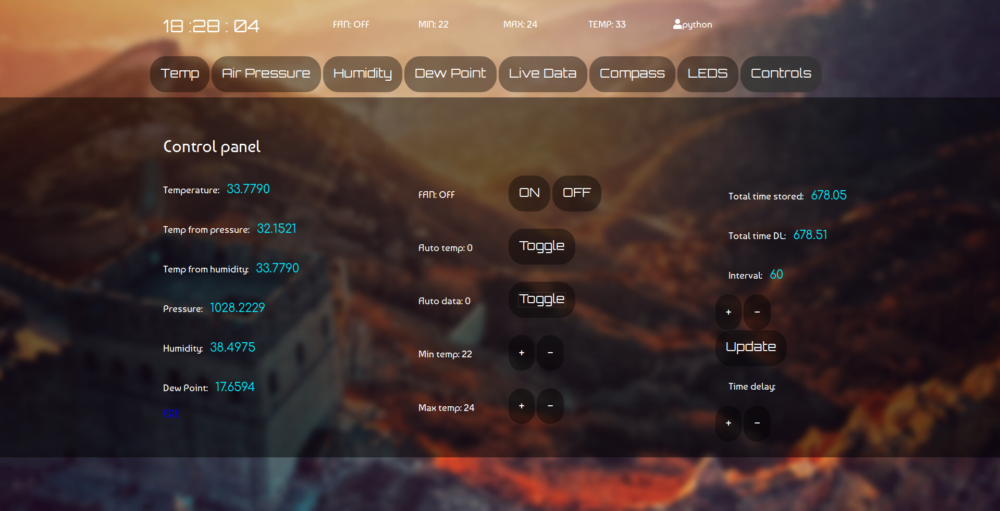

# sensehat_webapp
Full-stack web application that autonomously collects a dozen different weather related data points, stores them in a database, and sends them to a client when requested, which divides them into different graphs, and can even stream live data directly from the sensors, communicate to other internal servers via sockets to control a fan which is automatically regulated by a simple feedback loop.

